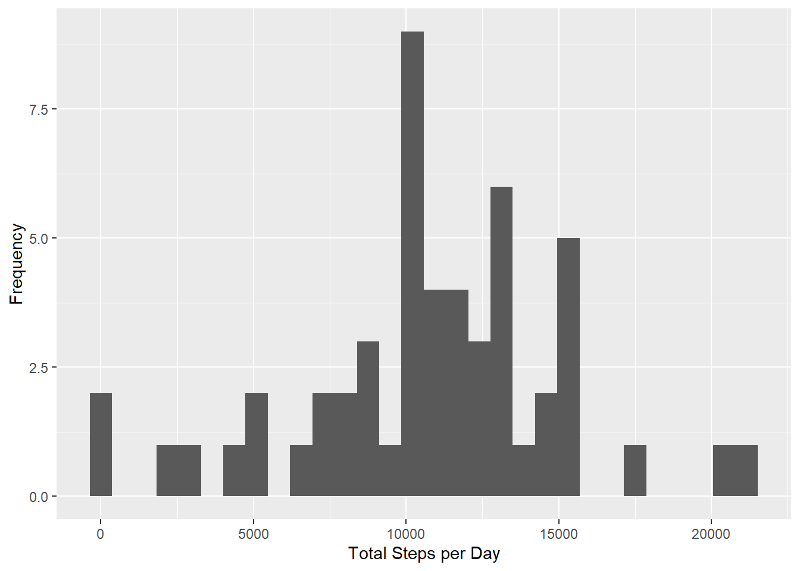
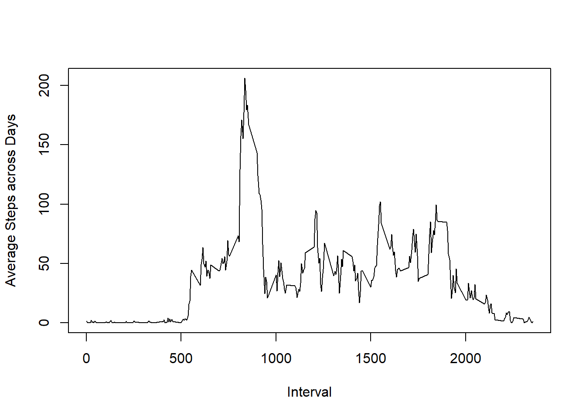
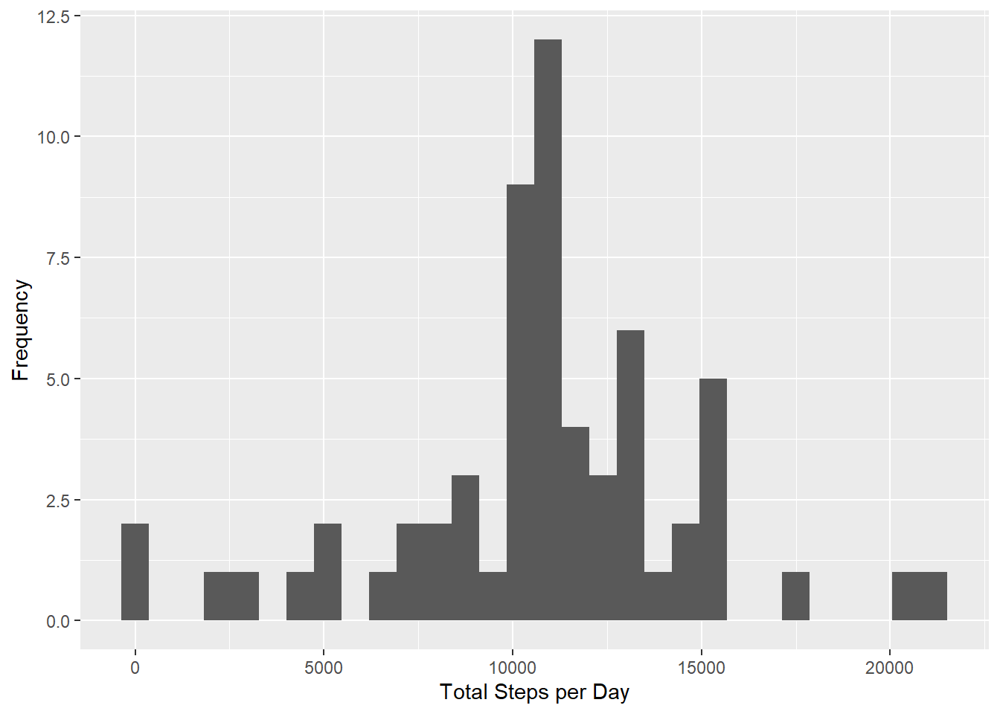
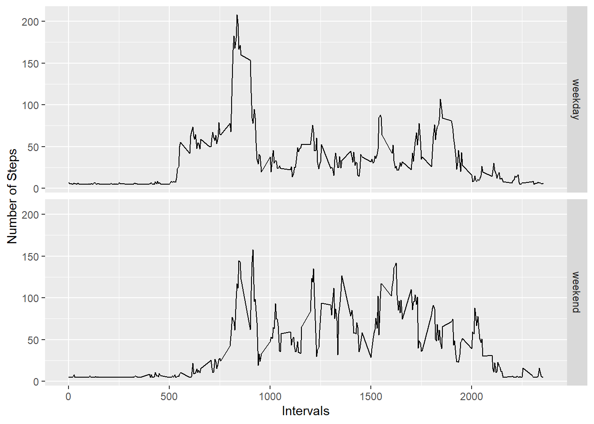

## Load and read the dataset

First, let's setup the working directory. Then we download and unzip the "Activity monitoring data":


```r
dataURL <- "https://d396qusza40orc.cloudfront.net/repdata%2Fdata%2Factivity.zip"
dest <-"./RepoduceRes_proj_1.zip"
download.file(dataURL, dest, method="curl")
if(!file.exists("activty")){unzip(dest)}
```

Next, let's read the dataset as .csv file which is seperated by comma:

```r
data <- read.csv("./activity.csv", header = TRUE, sep=",")
```

## What is mean total number of steps taken per day?

First, we calculate the total number of steps taken per day using functions in package "tidyr"&"dplyr" and save the output to the dataframe data_totalperday:


```r
library(tidyr)
library(dplyr)
```

```
## 
## Attaching package: 'dplyr'
```

```
## The following objects are masked from 'package:stats':
## 
##     filter, lag
```

```
## The following objects are masked from 'package:base':
## 
##     intersect, setdiff, setequal, union
```

```r
data_totalperday<- data %>% group_by(date) %>% summarise(total = sum(steps))
```

Next, we use package "ggplot2" to make a histogram of the total number of steps taken each day:


```r
library(ggplot2)
qplot(total, data = data_totalperday, ylab="Frequency", xlab="Total Steps per Day")
```

```
## `stat_bin()` using `bins = 30`. Pick better value with `binwidth`.
```

```
## Warning: Removed 8 rows containing non-finite values (stat_bin).
```




Lastly, we can calculate and report the mean and median of the total number of steps taken per day:


```r
median(data_totalperday$total, na.rm = TRUE)
```

```
## [1] 10765
```

```r
mean(data_totalperday$total, na.rm = TRUE)
```

```
## [1] 10766.19
```

So here the median value is 10765 while the mean value is 10766.19.

## What is the average daily activity pattern?

First, we reporcess the dataset to calculate the average steps across all days in each interval and save the output to a new dataframe called data_avgperday:


```r
data_avgperday<- data %>% group_by(interval) %>% summarise(avg = mean(steps, na.rm = TRUE))
```

Next, we make a time series plot  of the 5-minute interval (x-axis) and the average number of steps taken, averaged across all days (y-axis):


```r
with(data_avgperday, plot(interval, avg, type = "l", xlab = "Interval", ylab = "Average Steps across Days"))
```



Lastly, we will find the 5-minute interval on average across all the days in the dataset that contains the maximum number of steps (called max_inte here):


```r
max_inte <- filter(data_avgperday, avg==max(data_avgperday$avg, na.rm = TRUE))
max_inte
```

```
## # A tibble: 1 x 2
##   interval   avg
##      <int> <dbl>
## 1      835  206.
```

That means the max number of steps which is 206 happens at the interval value 835.

## Imputing missing values

First, we calculate and report the total number of missing values in the datase:


```r
summary(data)
```

```
##      steps                date          interval     
##  Min.   :  0.00   2012-10-01:  288   Min.   :   0.0  
##  1st Qu.:  0.00   2012-10-02:  288   1st Qu.: 588.8  
##  Median :  0.00   2012-10-03:  288   Median :1177.5  
##  Mean   : 37.38   2012-10-04:  288   Mean   :1177.5  
##  3rd Qu.: 12.00   2012-10-05:  288   3rd Qu.:1766.2  
##  Max.   :806.00   2012-10-06:  288   Max.   :2355.0  
##  NA's   :2304     (Other)   :15840
```

Next, we are going to devise a strategy for filling in all of the missing values in the dataset with the average steps in the entire dataset. Then we create a new dataset that is equal to the original dataset but with the missing data filled in (called data_imputed here):


```r
data_imputed <-data
data_imputed$steps[is.na(data_imputed$steps)] = mean(data_imputed$steps, na.rm = TRUE)
```

Next, we can make a histogram of the total number of steps taken each day:


```r
data_totalperday_imputed<- data_imputed %>% group_by(date) %>% summarise(total = sum(steps))
qplot(total, data = data_totalperday_imputed, ylab="Frequency", xlab="Total Steps per Day")
```

```
## `stat_bin()` using `bins = 30`. Pick better value with `binwidth`.
```



Lastly, we will alculate and report the mean and median total number of steps taken per day:


```r
median(data_totalperday_imputed$total, na.rm = TRUE)
```

```
## [1] 10766.19
```

```r
mean(data_totalperday_imputed$total, na.rm = TRUE)
```

```
## [1] 10766.19
```

Unsuprisingly, these values don't differ much from the estimates from the first part of the assignment because we fill the missing values with the averag step value across the entire dataset.

## Are there differences in activity patterns between weekdays and weekends?

First, we will create a new factor variable in the dataset with two levels – “weekday” and “weekend” indicating whether a given date is a weekday or weekend day. Remember to convert the data type in column "date" from factor to date class first:


```r
data_imputed$date<-as.character(data_imputed$date)
data_imputed$date<-as.Date(data_imputed$date)

weekdays1 <- c("Monday", "Tuesday", "Wednesday", "Thursday", "Friday")
data_imputed$dys <-factor((weekdays(data_imputed$date) %in% weekdays1), 
                            levels=c(FALSE, TRUE), labels=c("weekend", "weekday"))
```

Next, we will make a panel plot containing a time series plot of the 5-minute interval (x-axis) and the average number of steps taken, averaged across all weekday days or weekend days (y-axis). In order to do that, we need to generate a seperate datafrom called data_avgdys which contains the proper information for plotting:


```r
data_wkd<-filter(data_imputed, dys ==  "weekday")
data_wknd<-filter(data_imputed, dys ==  "weekend")
data_avgwkd<- data_wkd %>% group_by(interval) %>% summarise(avg = mean(steps, na.rm = TRUE))
data_avgwknd<- data_wknd %>% group_by(interval) %>% summarise(avg = mean(steps, na.rm = TRUE))
data_avgwkd$dys<-"weekday"
data_avgwknd$dys<-"weekend"
data_avgdys<- rbind(data_avgwkd, data_avgwknd)
```

Then we can generate the panel plots as suggested by the project requirements. Here I used package ggplot2 to make it: 


```r
g<-ggplot(data_avgdys, aes(x=interval, y=avg))
g+geom_line()+facet_grid(rows="dys")+labs(x="Intervals", y="Number of Steps")
```



